# 📚 Giải Thích Chi Tiết Code Backend

> Tài liệu này giải thích chi tiết logic của 4 file quan trọng trong hệ thống backend của Restaurant Website.

---

## 📋 Mục Lục

1. [Socket Service](#1-socket-service)
2. [Upload Cloud Middleware](#2-upload-cloud-middleware)
3. [Check Auth Middleware](#3-check-auth-middleware)
4. [Token Services](#4-token-services)

---

## 1. Socket Service

**File:** `backend/src/services/socket.service.ts`

### 📖 Tổng Quan

`SocketService` là một **Singleton Pattern** service dùng để quản lý kết nối WebSocket thời gian thực (real-time) giữa server và client sử dụng thư viện **Socket.IO**.

### 🔧 Cấu Trúc Class

```typescript
class SocketService {
  private io: SocketIOServer | null = null; // Instance Socket.IO server
  private adminSockets: Set<string> = new Set(); // Lưu trữ socket ID của admin
}
```

#### Thuộc tính:

| Thuộc tính     | Kiểu dữ liệu             | Mô tả                                             |
| -------------- | ------------------------ | ------------------------------------------------- |
| `io`           | `SocketIOServer \| null` | Instance của Socket.IO server, khởi tạo là `null` |
| `adminSockets` | `Set<string>`            | Tập hợp chứa các socket ID của admin đang kết nối |

### 📌 Chi Tiết Từng Phương Thức

---

#### **1.1. `initialize(httpServer: HTTPServer)`**

```typescript
initialize(httpServer: HTTPServer): SocketIOServer
```

**Mục đích:** Khởi tạo Socket.IO server và attach vào HTTP server.

**Luồng xử lý:**

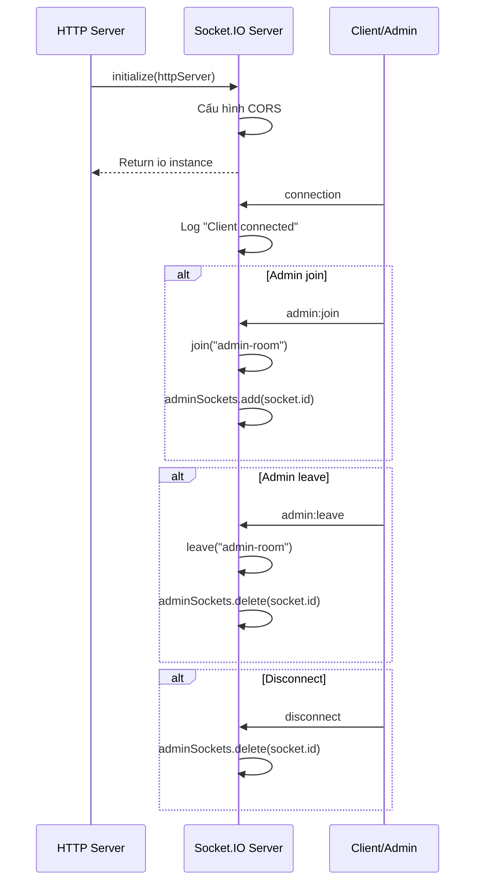

**Cấu hình CORS:**

```typescript
cors: {
  origin: "*",        // Cho phép mọi origin (lưu ý: production nên chỉ định cụ thể)
  methods: ["GET", "POST"],
  credentials: true,  // Cho phép gửi cookies/credentials
}
```

**Các Event Listeners:**

| Event         | Mô tả               | Hành động                                           |
| ------------- | ------------------- | --------------------------------------------------- |
| `connection`  | Client kết nối      | Log socket ID                                       |
| `admin:join`  | Admin tham gia      | Join vào room "admin-room", thêm vào `adminSockets` |
| `admin:leave` | Admin rời đi        | Rời khỏi "admin-room", xóa khỏi `adminSockets`      |
| `disconnect`  | Client ngắt kết nối | Xóa khỏi `adminSockets`                             |

> [!NOTE]
> Việc sử dụng **Room** (`admin-room`) cho phép broadcast thông báo đến tất cả admin đang online cùng lúc.

---

#### **1.2. `getIO()`**

```typescript
getIO(): SocketIOServer | null
```

**Mục đích:** Trả về instance của Socket.IO server để sử dụng ở nơi khác.

---

#### **1.3. `notifyNewOrder(orderData: any)`**

```typescript
notifyNewOrder(orderData: any): void
```

**Mục đích:** Gửi thông báo đơn hàng mới đến tất cả admin.

**Payload gửi đi:**

```typescript
{
  type: "NEW_ORDER",
  message: "Có đơn hàng mới!",
  data: orderData,
  timestamp: new Date().toISOString()
}
```

**Event emitted:** `order:new`

---

#### **1.4. `notifyPaymentSuccess(orderData: any)`**

```typescript
notifyPaymentSuccess(orderData: any): void
```

**Mục đích:** Thông báo thanh toán thành công.

**Payload gửi đi:**

```typescript
{
  type: "PAYMENT_SUCCESS",
  message: "Thanh toán thành công!",
  data: orderData,
  timestamp: new Date().toISOString()
}
```

**Event emitted:** `payment:success`

---

#### **1.5. `notifyOrderStatusUpdate(orderData: any)`**

```typescript
notifyOrderStatusUpdate(orderData: any): void
```

**Mục đích:** Thông báo cập nhật trạng thái đơn hàng.

**Event emitted:** `order:statusUpdate`

---

#### **1.6. `notifyUser(userId: string, event: string, data: any)`**

```typescript
notifyUser(userId: string, event: string, data: any): void
```

**Mục đích:** Gửi thông báo đến một user cụ thể thông qua room `user-{userId}`.

> [!IMPORTANT]
> Để phương thức này hoạt động, client phải join vào room `user-{userId}` khi đăng nhập.

---

### 🎯 Singleton Pattern

```typescript
const socketService = new SocketService();
export default socketService;
```

Việc export một instance duy nhất đảm bảo toàn bộ ứng dụng sử dụng cùng một Socket.IO server instance.

---

## 2. Upload Cloud Middleware

**File:** `backend/src/middlewares/uploadCloud.middleware.ts`

### 📖 Tổng Quan

Middleware này xử lý việc upload file lên **Cloudinary** - một cloud-based image/video management service.

### 🔧 Cấu Hình Cloudinary

```typescript
cloudinary.config({
  cloud_name: process.env.CLOUD_NAME || process.env.CLOUDINARY_CLOUD_NAME,
  api_key: process.env.API_KEY || process.env.CLOUDINARY_API_KEY,
  api_secret: process.env.API_SECRET || process.env.CLOUDINARY_API_SECRET,
});
```

> [!NOTE]
> Hỗ trợ 2 naming conventions cho biến môi trường để tăng tính linh hoạt.

### 📌 Chi Tiết Middleware `uploadImage`

```typescript
export const uploadImage = async (req: Request, res: Response, next: NextFunction)
```

**Luồng xử lý chi tiết:**

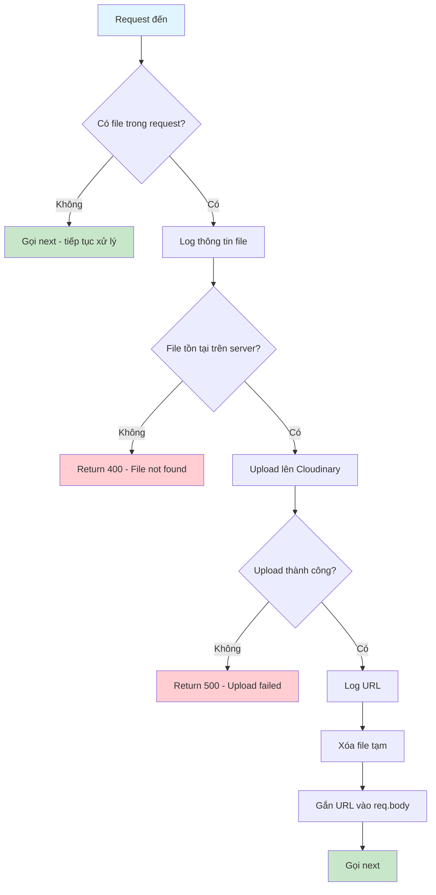

### 📋 Bảng Giải Thích Từng Bước

| Bước | Code                                      | Giải thích                                                                  |
| ---- | ----------------------------------------- | --------------------------------------------------------------------------- |
| 1    | `const file = (req as any).file`          | Lấy file từ request (được xử lý bởi Multer trước đó)                        |
| 2    | `if (!file) return next()`                | Nếu không có file, cho phép request tiếp tục (có thể request không cần ảnh) |
| 3    | `fs.existsSync(file.path)`                | Kiểm tra file tạm có tồn tại trên server không                              |
| 4    | `cloudinary.uploader.upload()`            | Upload file lên Cloudinary với cấu hình folder "dishes_images"              |
| 5    | `fs.unlinkSync(file.path)`                | Xóa file tạm sau khi upload thành công                                      |
| 6    | `req.body[fieldName] = result.secure_url` | Gắn URL ảnh vào body để controller lưu vào database                         |

### ⚙️ Cấu Hình Upload

```typescript
{
  folder: "dishes_images",    // Thư mục lưu trữ trên Cloudinary
  resource_type: "auto",      // Tự động detect loại file (image, video, raw)
}
```

### 🔄 Dynamic Field Name

```typescript
const fieldName = file.fieldname || "image";
req.body[fieldName] = result.secure_url;
```

Điều này cho phép middleware linh hoạt với nhiều field name khác nhau (`image`, `thumbnail`, `avatar`...).

---

## 3. Check Auth Middleware

**File:** `backend/src/auth/checkAuth.auth.ts`

### 📖 Tổng Quan

File này chứa 2 middleware để xác thực (authentication) và phân quyền (authorization):

- `auth` - Xác thực user đã đăng nhập
- `authAdmin` - Xác thực user là admin

### 📌 Middleware `auth`

```typescript
const auth = async (req: Request, res: Response, next: NextFunction)
```

**Luồng xử lý:**

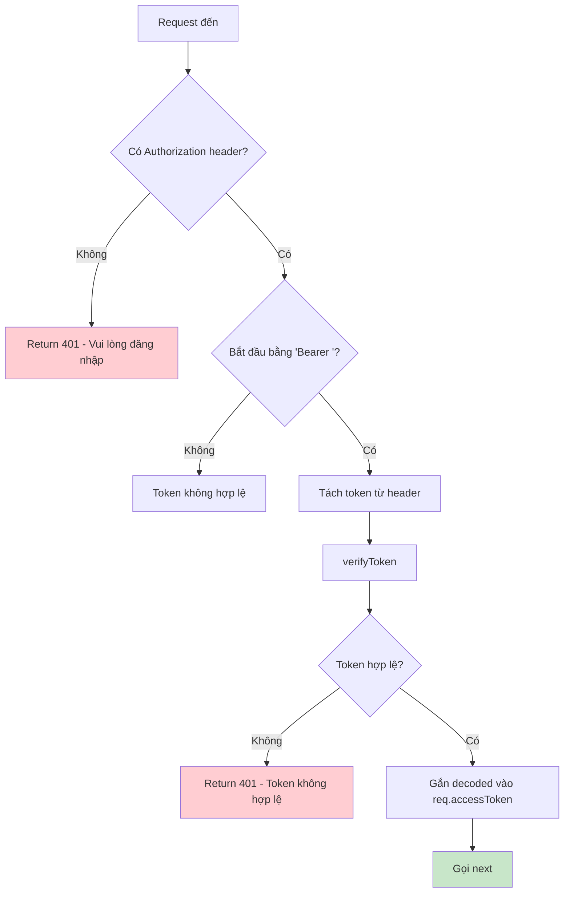

**Chi tiết code:**

```typescript
// Bước 1: Lấy Authorization header
const authHeader = req.headers.authorization;

// Bước 2: Kiểm tra và tách Bearer token
if (authHeader && authHeader.startsWith("Bearer ")) {
  token = authHeader.substring(7); // Loại bỏ "Bearer " (7 ký tự)
}

// Bước 3: Verify token
const decoded = await verifyToken(token);

// Bước 4: Gắn thông tin user vào request
(req as any).accessToken = decoded;
```

### 📌 Middleware `authAdmin`

```typescript
const authAdmin = async (req: Request, res: Response, next: NextFunction)
```

**Luồng xử lý:**

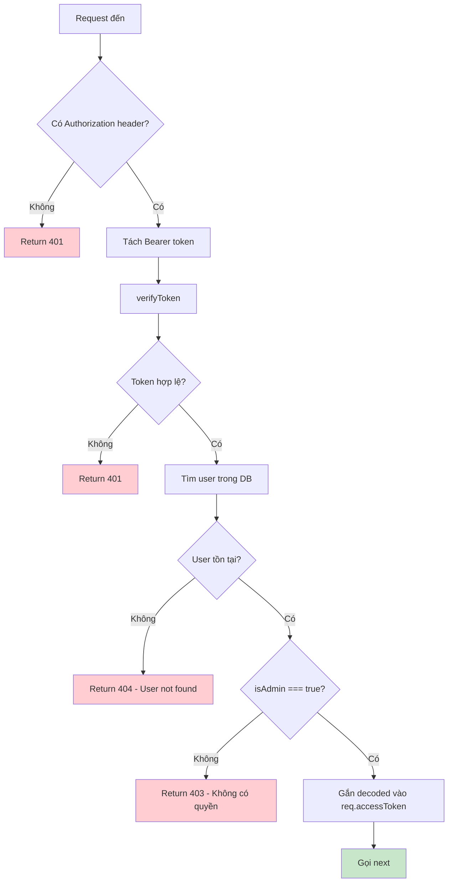

### 📋 So Sánh `auth` vs `authAdmin`

| Đặc điểm             | `auth`                    | `authAdmin`            |
| -------------------- | ------------------------- | ---------------------- |
| Kiểm tra token       | ✅                        | ✅                     |
| Verify token         | ✅                        | ✅                     |
| Tìm user trong DB    | ❌                        | ✅                     |
| Kiểm tra quyền admin | ❌                        | ✅                     |
| Use case             | API cho user đã đăng nhập | API chỉ dành cho admin |

### 🔐 HTTP Status Codes

| Code | Ý nghĩa      | Khi nào trả về                         |
| ---- | ------------ | -------------------------------------- |
| 401  | Unauthorized | Không có token hoặc token không hợp lệ |
| 403  | Forbidden    | User không phải admin                  |
| 404  | Not Found    | User không tồn tại trong database      |

---

## 4. Token Services

**File:** `backend/src/utils/auth/tokenServices.ts`

### 📖 Tổng Quan

File này quản lý việc tạo và xác thực JWT tokens sử dụng **asymmetric encryption (RSA)** thay vì symmetric key thông thường.

> [!IMPORTANT] > **Asymmetric Encryption (RSA):** Sử dụng cặp khóa public/private. Private key để ký (sign), public key để xác thực (verify). An toàn hơn symmetric encryption.

### 🔑 Kiến Trúc RSA Key Pair

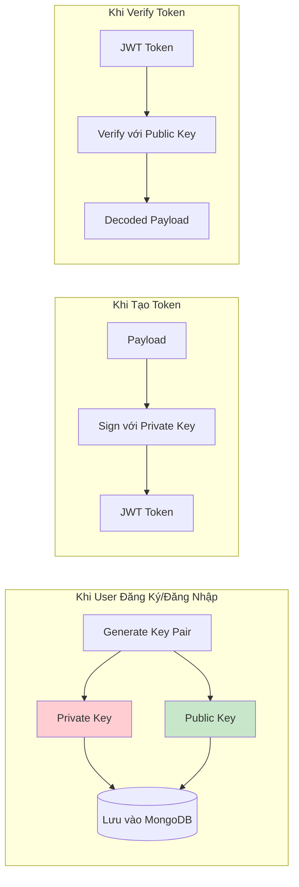

### 📌 Chi Tiết Từng Function

---

#### **4.1. `createApiKey(userId: string)`**

```typescript
export const createApiKey = async (userId: string): Promise<IApiKey>
```

**Mục đích:** Tạo cặp khóa RSA mới cho user và lưu vào database.

**Chi tiết luồng:**

```typescript
// Bước 1: Tạo cặp khóa RSA 2048-bit
const { publicKey, privateKey } = crypto.generateKeyPairSync("rsa", {
  modulusLength: 2048,
});

// Bước 2: Chuyển đổi key object sang string để lưu trữ
// Private key: PKCS#8 format
const privateKeyString = privateKey.export({
  type: "pkcs8", // PKCS#8 - định dạng chuẩn cho private key
  format: "pem", // PEM - text-based encoding
}) as string;

// Public key: SPKI format
const publicKeyString = publicKey.export({
  type: "spki", // Subject Public Key Info - định dạng chuẩn cho public key
  format: "pem",
}) as string;

// Bước 3: Lưu vào database
const newApiKey = new ApiKeyModel({
  userId,
  publicKey: publicKeyString,
  privateKey: privateKeyString,
});
return await newApiKey.save();
```

> [!NOTE] > **Tại sao cần export key?**
>
> `crypto.generateKeyPairSync()` trả về object phức tạp không thể lưu trực tiếp. Cần chuyển sang string format (PEM) để lưu vào MongoDB.

---

#### **4.2. `createAccessToken(payload: any)`**

```typescript
export const createAccessToken = async (payload: any): Promise<string>
```

**Mục đích:** Tạo Access Token (thời hạn ngắn - 1 giờ).

**Luồng xử lý:**

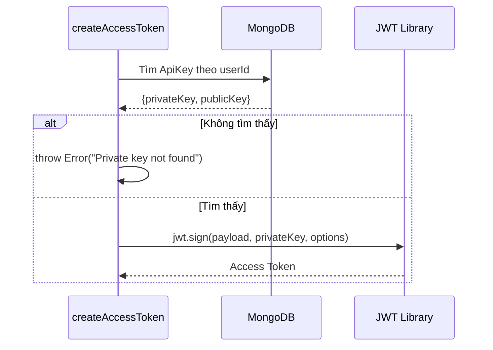

**Cấu hình JWT:**

```typescript
{
  algorithm: "RS256",  // RSA + SHA-256
  expiresIn: "1h",     // Hết hạn sau 1 giờ
}
```

---

#### **4.3. `createRefreshToken(payload: any)`**

```typescript
export const createRefreshToken = async (payload: any): Promise<string>
```

**Mục đích:** Tạo Refresh Token (thời hạn dài - 7 ngày).

**Giống `createAccessToken` nhưng:**

```typescript
{
  algorithm: "RS256",
  expiresIn: "7d",  // Hết hạn sau 7 ngày
}
```

---

#### **4.4. `refreshAccessToken(req: Request, res?: Response)`**

```typescript
export const refreshAccessToken = async (req: Request, res?: Response): Promise<string | null>
```

**Mục đích:** Làm mới Access Token khi hết hạn, sử dụng Refresh Token.

**Luồng xử lý:**

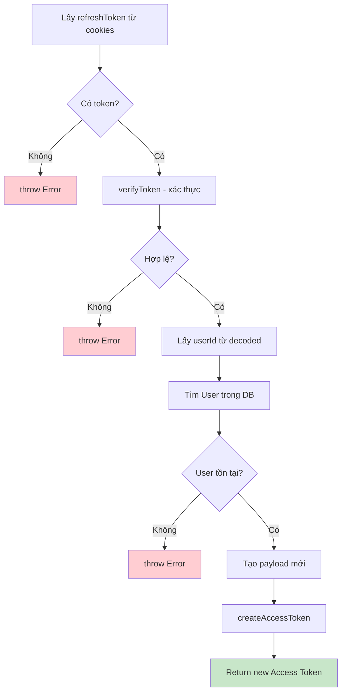

**Payload mới:**

```typescript
{
  id: user._id,
  email: user.email,
  username: user.username,
  isAdmin: user.isAdmin,
}
```

---

#### **4.5. `verifyToken(token: string)`**

```typescript
export const verifyToken = async (token: string): Promise<any>
```

**Mục đích:** Xác thực và decode JWT token.

**Luồng xử lý đặc biệt:**

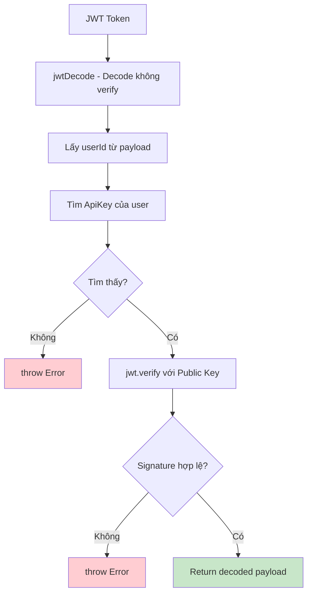

> [!CAUTION] > **Bước quan trọng:**
>
> 1. Đầu tiên decode token **KHÔNG verify** để lấy `userId`
> 2. Dùng `userId` tìm public key của user đó
> 3. Sau đó mới verify signature với public key tương ứng

**Code chi tiết:**

```typescript
// Bước 1: Decode không verify (chỉ đọc payload)
const decoded = jwtDecode<{ id: string }>(token);
const { id } = decoded;

// Bước 2: Tìm public key của user
const findApiKey = await ApiKeyModel.findOne({ userId: id });

// Bước 3: Verify signature với public key
return jwt.verify(token, findApiKey.publicKey, {
  algorithms: ["RS256"],
});
```

---

### 🔐 Tóm Tắt Luồng Authentication

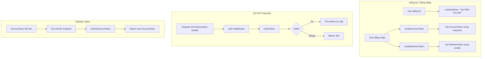

---

## 5. Google OAuth2 Authentication

**Files:**

- `backend/src/controllers/user.controller.ts`
- `backend/src/routes/user.route.ts`

### 📖 Tổng Quan

Hệ thống hỗ trợ đăng nhập bằng **Google OAuth2** - cho phép người dùng xác thực thông qua tài khoản Google mà không cần tạo mật khẩu riêng.

### 🔐 OAuth2 Flow

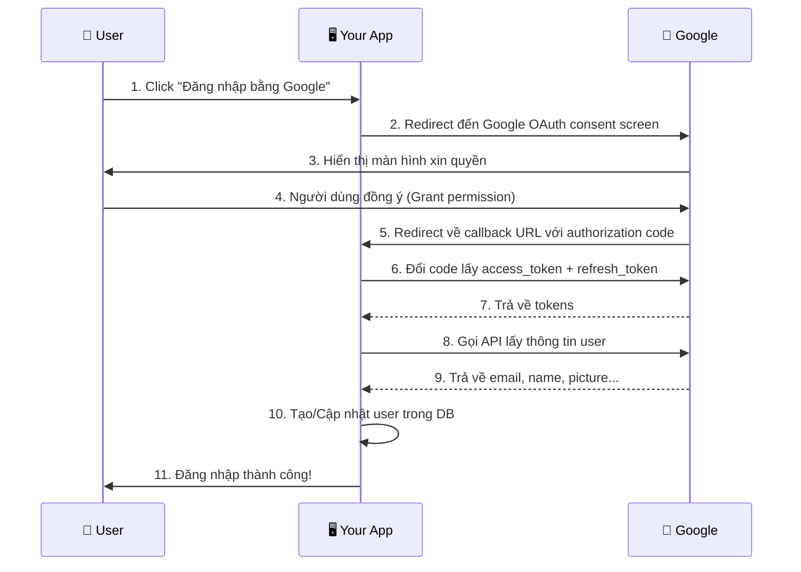

### 📋 Routes Configuration

```typescript
// File: user.route.ts
router.get("/auth/google", controller.googleAuth);
router.get("/auth/google/callback", controller.googleAuthCallback);
```

| Route                   | Method | Mô tả                                         |
| ----------------------- | ------ | --------------------------------------------- |
| `/auth/google`          | GET    | Khởi tạo OAuth flow, redirect đến Google      |
| `/auth/google/callback` | GET    | Google redirect về đây với authorization code |

### 📌 Chi Tiết Từng Function

---

#### **5.1. `googleAuth(req, res)`**

**Mục đích:** Khởi tạo luồng OAuth2 và redirect user đến Google consent screen.

**Code chi tiết:**

```typescript
export const googleAuth = async (req: Request, res: Response) => {
  try {
    // Bước 1: Tạo OAuth2 Client với credentials từ Google Cloud Console
    const oauth2Client = new google.auth.OAuth2(
      process.env.GOOGLE_CLIENT_ID, // Client ID từ Google Cloud
      process.env.GOOGLE_CLIENT_SECRET, // Client Secret từ Google Cloud
      process.env.GOOGLE_REDIRECT_URI // URL callback (phải match với cấu hình trên Google Cloud)
    );

    // Bước 2: Định nghĩa các quyền cần xin
    const SCOPES = ["profile", "email"];

    // Bước 3: Tạo URL authorization
    const authUrl = oauth2Client.generateAuthUrl({
      access_type: "offline", // Yêu cầu refresh_token để có thể làm mới token
      prompt: "consent", // Luôn hiển thị màn hình consent (cần thiết để nhận refresh_token)
      scope: SCOPES, // Các quyền cần xin: profile và email
    });

    // Bước 4: Redirect user đến Google
    res.redirect(authUrl);
  } catch (error) {
    // Xử lý lỗi
  }
};
```

**Giải thích các tham số:**

| Tham số       | Giá trị                | Ý nghĩa                                                                                                                           |
| ------------- | ---------------------- | --------------------------------------------------------------------------------------------------------------------------------- |
| `access_type` | `"offline"`            | Yêu cầu Google cấp `refresh_token` để có thể làm mới access token mà không cần user đăng nhập lại                                 |
| `prompt`      | `"consent"`            | Luôn hiển thị màn hình xin quyền. **Quan trọng:** Nếu không set, Google sẽ không trả về `refresh_token` ở lần đăng nhập tiếp theo |
| `scope`       | `["profile", "email"]` | Các quyền cần xin: thông tin profile (tên, ảnh) và email                                                                          |

> [!IMPORTANT] > **Environment Variables cần thiết:**
>
> - `GOOGLE_CLIENT_ID` - Lấy từ Google Cloud Console
> - `GOOGLE_CLIENT_SECRET` - Lấy từ Google Cloud Console
> - `GOOGLE_REDIRECT_URI` - URL callback (VD: `http://localhost:5000/api/v1/users/auth/google/callback`)

---

#### **5.2. `googleAuthCallback(req, res)`**

**Mục đích:** Xử lý callback từ Google, đổi authorization code lấy tokens, và tạo/đăng nhập user.

**Luồng xử lý chi tiết:**

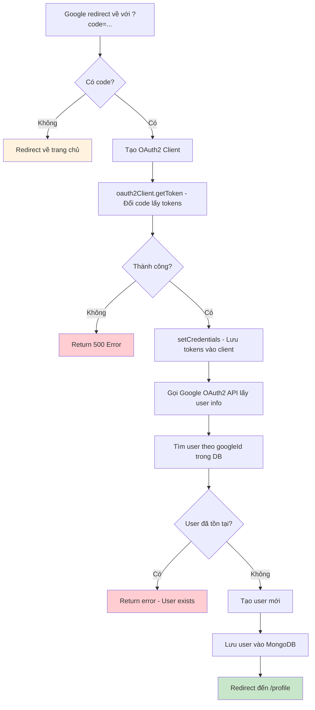

**Code chi tiết với comments:**

```typescript
export const googleAuthCallback = async (req: Request, res: Response) => {
  try {
    // ============ BƯỚC 1: Lấy authorization code từ URL ============
    const code = req.query.code as string;
    // URL sẽ có dạng: /auth/google/callback?code=4/0AX4XfW...

    if (!code) {
      return res.redirect("/"); // Không có code = user cancel hoặc lỗi
    }

    // ============ BƯỚC 2: Tạo OAuth2 Client (giống như ở googleAuth) ============
    const oauth2Client = new google.auth.OAuth2(
      process.env.GOOGLE_CLIENT_ID,
      process.env.GOOGLE_CLIENT_SECRET,
      process.env.GOOGLE_REDIRECT_URI
    );

    // ============ BƯỚC 3: Đổi authorization code lấy tokens ============
    const { tokens } = await oauth2Client.getToken(code);
    // tokens = {
    //   access_token: "ya29.xxx...",   // Token để gọi Google APIs
    //   refresh_token: "1//0exxx...",  // Token để làm mới access_token
    //   expiry_date: 1699999999999,    // Thời điểm hết hạn (timestamp)
    //   token_type: "Bearer",
    //   scope: "profile email"
    // }

    // ============ BƯỚC 4: Set credentials vào client ============
    oauth2Client.setCredentials(tokens);

    // ============ BƯỚC 5: Lấy thông tin user từ Google ============
    const oauth2 = google.oauth2({ version: "v2", auth: oauth2Client });
    const userinfo = await oauth2.userinfo.get();
    // userinfo.data = {
    //   id: "11234567890123456789",  // Google ID (unique)
    //   email: "user@gmail.com",
    //   name: "Nguyễn Văn A",
    //   picture: "https://lh3.googleusercontent.com/...",
    //   verified_email: true
    // }

    // ============ BƯỚC 6: Kiểm tra user đã tồn tại chưa ============
    const user = await User.findOne({ googleId: userinfo.data.id });

    if (user) {
      // User đã tồn tại - có thể redirect đến login hoặc profile
      return new BadRequestError("User already exists").send(res);
    }

    // ============ BƯỚC 7: Tạo user mới ============
    const newUser = new User({
      username: userinfo.data.name, // Tên từ Google
      email: userinfo.data.email, // Email từ Google
      password: "", // Không cần password
      googleId: userinfo.data.id, // Lưu Google ID để nhận diện
      loginMethod: "google", // Đánh dấu phương thức đăng nhập
      isAdmin: false, // Mặc định không phải admin
      avatar: userinfo.data.picture || "", // Ảnh đại diện từ Google
      refreshToken: tokens.refresh_token, // Lưu refresh token của Google
    });

    await newUser.save();

    // ============ BƯỚC 8: Redirect đến profile ============
    return res.redirect("/profile");
  } catch (error) {
    return res.status(500).send("Authentication error");
  }
};
```

### 📊 User Schema cho Google Auth

Khi tạo user qua Google, các field đặc biệt được sử dụng:

| Field          | Giá trị                  | Mô tả                                       |
| -------------- | ------------------------ | ------------------------------------------- |
| `googleId`     | `"11234567890123456789"` | ID unique từ Google, dùng để nhận diện user |
| `loginMethod`  | `"google"`               | Phân biệt với user đăng ký thông thường     |
| `password`     | `""`                     | Trống vì không cần password                 |
| `avatar`       | URL từ Google            | Ảnh profile của user trên Google            |
| `refreshToken` | Google refresh token     | Dùng để làm mới access token khi cần        |

### 🔄 So Sánh Login Thường vs Google Login

```mermaid
graph TB
    subgraph "Login Thường"
        A1[User nhập email + password] --> A2[Kiểm tra email tồn tại]
        A2 --> A3[So sánh password với bcrypt]
        A3 --> A4[Tạo JWT tokens]
        A4 --> A5[Return access_token + set cookie]
    end

    subgraph "Google Login"
        B1[User click đăng nhập Google] --> B2[Redirect đến Google]
        B2 --> B3[User đồng ý chia sẻ thông tin]
        B3 --> B4[Google redirect về với code]
        B4 --> B5[Đổi code lấy tokens từ Google]
        B5 --> B6[Lấy thông tin user từ Google]
        B6 --> B7[Tạo/Cập nhật user trong DB]
        B7 --> B8[Redirect đến profile]
    end
```

| Đặc điểm         | Login Thường             | Google Login                |
| ---------------- | ------------------------ | --------------------------- |
| Cần password     | ✅ Bắt buộc              | ❌ Không cần                |
| Verify email     | ❌ Có thể fake           | ✅ Google đã verify         |
| Avatar           | 👤 User tự upload        | 📷 Lấy từ Google            |
| Bảo mật password | 🔒 Hash với bcrypt       | 🔐 Google quản lý           |
| Remember session | 🍪 Refresh token của app | 🔄 Refresh token của Google |

### ⚠️ Lưu Ý Quan Trọng

> [!CAUTION] > **Bug tiềm ẩn trong code hiện tại:**
>
> ```typescript
> if (user) {
>   return new BadRequestError("User already exists").send(res);
> }
> if (!user) {
>   // Tạo user mới
> }
> ```
>
> Logic này sẽ **không cho phép user đăng nhập lại** nếu đã có tài khoản. Nên sửa thành:
>
> - Nếu user tồn tại → Đăng nhập và tạo JWT tokens
> - Nếu user chưa tồn tại → Tạo mới và đăng nhập

> [!TIP] > **Cải thiện đề xuất:**
>
> - Tạo JWT access/refresh token cho cả Google login
> - Cho phép liên kết tài khoản Google với tài khoản thường (cùng email)
> - Xử lý trường hợp email Google trùng với email đã đăng ký thường

### 🛠️ Cấu Hình Google Cloud Console

Để OAuth2 hoạt động, cần cấu hình trên [Google Cloud Console](https://console.cloud.google.com/):

1. **Tạo Project mới** (hoặc dùng project có sẵn)
2. **Bật Google+ API hoặc People API**
3. **Tạo OAuth 2.0 Credentials:**
   - Application type: Web application
   - Authorized redirect URIs: `http://localhost:5000/api/v1/users/auth/google/callback`
4. **Cấu hình OAuth consent screen:**
   - User Type: External
   - Scopes: `email`, `profile`

---

## 📊 Bảng Tổng Hợp Các Function/Middleware

| File                        | Function/Middleware                       | Mục đích                          |
| --------------------------- | ----------------------------------------- | --------------------------------- |
| `socket.service.ts`         | `SocketService.initialize()`              | Khởi tạo WebSocket server         |
|                             | `SocketService.notifyNewOrder()`          | Thông báo đơn hàng mới cho admin  |
|                             | `SocketService.notifyPaymentSuccess()`    | Thông báo thanh toán thành công   |
|                             | `SocketService.notifyOrderStatusUpdate()` | Thông báo cập nhật trạng thái đơn |
|                             | `SocketService.notifyUser()`              | Gửi thông báo cho user cụ thể     |
| `uploadCloud.middleware.ts` | `uploadImage`                             | Upload file lên Cloudinary        |
| `checkAuth.auth.ts`         | `auth`                                    | Xác thực user đã đăng nhập        |
|                             | `authAdmin`                               | Xác thực user là admin            |
| `tokenServices.ts`          | `createApiKey()`                          | Tạo RSA key pair cho user         |
|                             | `createAccessToken()`                     | Tạo JWT Access Token (1h)         |
|                             | `createRefreshToken()`                    | Tạo JWT Refresh Token (7d)        |
|                             | `refreshAccessToken()`                    | Làm mới Access Token              |
|                             | `verifyToken()`                           | Xác thực JWT token                |

---

## 🔗 Mối Quan Hệ Giữa Các File

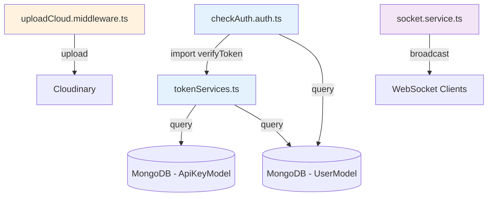

---

> [!TIP] > **Best Practices được áp dụng:**
>
> - ✅ Singleton Pattern (Socket Service)
> - ✅ Asymmetric Encryption (RSA cho JWT)
> - ✅ Separation of Concerns (Middleware riêng biệt)
> - ✅ Error Handling đầy đủ
> - ✅ Environment Variables cho config
